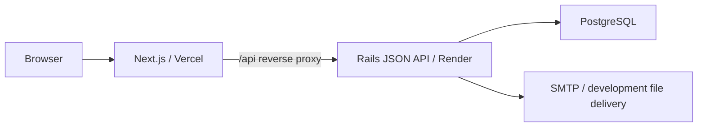

# Intern Scout Service

インターン生と企業をつなぐスカウトサービスのプロトタイプです。
企業からのスカウトと、企業が掲載した募集へのインターン生からの応募を、
同じ1対1の会話につなげます。
企業と学生のどちらか一方ではなく、双方が相手を判断できる情報と、スカウト・応募から会話へ自然につながる体験を重視しました。

## 公開デモ

- Web: [https://intern-scout-service.vercel.app](https://intern-scout-service.vercel.app)
- API health: [https://intern-scout-api.onrender.com/api/v1/health](https://intern-scout-api.onrender.com/api/v1/health)

登録画面でインターン生または企業担当者を選び、`.example` で終わる架空の
メールアドレスを使って新規登録できます。実在する個人情報は入力しないでください。

Renderの無料Web Serviceがアイドル時に停止するため、初回のAPIアクセスには
時間がかかることがあります。

## 技術課題への対応

| 課題の要件 | 実装内容 |
|---|---|
| Railsを使用 | Rails 8.1のJSON APIとして実装 |
| Next.jsを使用 | Next.js 16とTypeScriptでUIを実装 |
| インターン生が登録できる | アカウント登録、ログイン、経験・制作物を含むプロフィール作成・編集を実装 |
| 企業がインターン生にメッセージを送れる | 学生検索、スカウト開始、1対1の継続メッセージを実装 |
| 企業が募集を掲載できる | 募集の作成、編集、公開、公開停止、企業紹介・ホームページ表示を実装 |
| 自由な追加機能 | 学校名・希望職種・技術スタック検索、募集への応募、パスワード再設定、退会・匿名化を実装 |

## 主要な利用フロー

### 企業からスカウトする

1. 企業担当者として登録・ログインする。
2. 学校名、希望職種、技術スタックでインターン生を探す。
3. プロフィール詳細からスカウトメッセージを送る。
4. 同じ相手との会話を再利用し、メッセージを継続する。

### 募集に応募する

1. 企業担当者が募集を作成し、公開する。
2. インターン生が公開募集を閲覧し、確認後に応募する。
3. 応募記録、会話の作成または再利用、自動メッセージ送信を
   1つのDBトランザクションで実行する。

## 工夫した点

### 1. 利用者ごとの入口を分かりやすくする

トップ画面では、インターン生と企業担当者の登録導線を同じ強さで表示しています。
それぞれがサービスでできることを短く添え、自分に合った入口を迷わず選べるようにしました。

### 2. 相手を判断しやすい情報を見せる

企業は学生の学校名や技術スタックだけでなく「経験・制作物」を確認でき、学生は募集内容に
加えて企業紹介やホームページを確認できます。双方が次の行動を判断するために必要な情報を、
一覧と詳細で段階的に把握できる構成にしました。

### 3. 操作結果と次の行動を明確にする

読み込み中、データがない場合、通信に失敗した場合をそれぞれ表示し、再読み込みや登録などの
次の行動へ進めるようにしています。応募済みや保存完了も画面上で伝え、操作できたか分からない
状態を避けました。

### 4. 端末や操作方法を問わず使いやすくする

スマートフォンでも主要な操作へ移動しやすいナビゲーションを用意しました。フォームには
入力項目名とエラー表示を設け、キーボード操作時の現在位置やスクリーンリーダーへの通知も
考慮しています。

詳細は[architecture.md](docs/architecture.md)と各機能の詳細設計を参照してください。

## アーキテクチャ



Next.jsからRails APIへreverse proxyし、ブラウザから見たoriginを統一して
CookieとCSRF tokenを扱いやすくしています。無料公開環境では、MVPで不要な
cache、queue、realtime用DBを追加せず、1台のPostgreSQLで構成しています。

## 使用技術

| 分類 | 技術 |
|---|---|
| フロントエンド | Next.js 16、React 19、TypeScript |
| バックエンド | Rails 8.1 JSON API、Ruby 3.4 |
| データベース | PostgreSQL 17 |
| テスト | Vitest、React Testing Library、Minitest |
| 開発環境 | Docker Compose |
| CI | GitHub Actions |
| 公開環境 | Vercel、Render |

## セットアップ

### 必要なもの

- Node.js 20.9以上
- npm
- Docker Desktop

### 初回セットアップ

```bash
git clone https://github.com/yuki-392/intern-scout-service.git
cd intern-scout-service
cp .env.example .env
cp frontend/.env.example frontend/.env.local
npm --prefix frontend ci
docker compose build backend
docker compose up -d db
docker compose run --rm backend bin/rails db:prepare
```

ローカル開発では、`.env` と `frontend/.env.local` の `DEMO_MODE` を
どちらも `false` にします。公開デモと同じ入力制限を確認する場合は、
どちらも `true` にしてください。

### 架空のデモデータ

`.env` の `DEMO_USER_PASSWORD` に8文字以上のローカル用パスワードを設定し、
seedを実行します。

```bash
docker compose run --rm backend bin/rails db:seed
```

| 種別 | メールアドレス |
|---|---|
| 企業 | `company@demo.example` |
| 企業 | `startup@demo.example` |
| インターン生 | `intern@demo.example` |
| インターン生 | `frontend-intern@demo.example` |
| インターン生 | `data-intern@demo.example` |

パスワードはすべて `.env` に設定した値です。seedは再実行しても、
同じメールアドレスのデータを重複作成しません。

企業2社には紹介文とホームページURL、学生3名には異なる希望職種と技術スタックを
設定しています。スカウト、返信、募集応募の会話例も用意しているため、両方の利用者
視点で主要導線を確認できます。

### 起動

Rails APIを起動します。

```bash
docker compose up backend
```

別のターミナルでNext.jsを起動します。

```bash
npm --prefix frontend run dev
```

- Web: [http://localhost:3000](http://localhost:3000)
- API health: [http://localhost:3001/api/v1/health](http://localhost:3001/api/v1/health)

終了時は `docker compose down` を実行します。

## 環境変数

| 配置先 | 変数 | 用途 |
|---|---|---|
| `frontend/.env.local` | `BACKEND_ORIGIN` | Next.jsが接続するRails APIのorigin |
| `frontend/.env.local` | `SUPPORT_CONTACT_URL` | パスワードを忘れた場合の問い合わせ先 |
| `frontend/.env.local` | `SUPPORT_CONTACT_LABEL` | 問い合わせ先の表示名 |
| Rails実行環境 | `DATABASE_URL` | PostgreSQL接続情報 |
| Rails実行環境 | `DEMO_USER_PASSWORD` | seedアカウントの共通パスワード |
| Rails実行環境 | `LOAD_DEMO_SEEDS` | `true` の場合、コンテナ起動時にseedを再投入する |
| Rails実行環境と `frontend/.env.local` | `DEMO_MODE` | `.example` の架空メールだけ登録できる公開デモ制限 |
| Rails実行環境 | `FRONTEND_ORIGIN` | パスワード再設定リンクの送信先origin |
| Rails実行環境 | `SMTP_ADDRESS` / `SMTP_PORT` | 再設定メール用SMTPサーバー |
| Rails実行環境 | `SMTP_USERNAME` / `SMTP_PASSWORD` | SMTP認証情報 |
| Rails実行環境 | `MAIL_FROM` | 再設定メールの送信元 |

development環境の再設定メールは外部送信せず、`backend/tmp/mails` に保存します。
production環境ではSMTP関連の環境変数を設定してください。

## テストとCI

GitHub Actionsで、pull requestと `main` へのpush時に次を実行します。

- フロントエンド: lint、型チェック、Vitest、production build
- バックエンド: Minitest、`zeitwerk:check`、RuboCop、Brakeman、Bundler Audit

フロントエンド:

```bash
npm --prefix frontend run lint
npm --prefix frontend run typecheck
npm --prefix frontend run test
npm --prefix frontend run build
```

バックエンド:

```bash
docker compose up -d db
docker compose run --rm \
  -e RAILS_ENV=test \
  -e DATABASE_URL=postgresql://postgres:postgres@db:5432/intern_scout_test \
  backend bin/rails db:prepare
docker compose run --rm \
  -e RAILS_ENV=test \
  -e DATABASE_URL=postgresql://postgres:postgres@db:5432/intern_scout_test \
  backend bin/rails test
docker compose run --rm backend bin/rails zeitwerk:check
docker compose run --rm backend bin/rubocop
docker compose run --rm backend bin/brakeman --no-pager
docker compose run --rm backend bin/bundler-audit check --update
```

主に、正常系に加えて次をテストしています。

- 未認証、ユーザー種別、所有者、会話参加者によるアクセス制御
- 入力上限、重複登録・応募、トランザクションのロールバック
- CSRF token失効時の再取得・再送上限とエラー形式
- ページネーションとN+1クエリの防止
- セッション切れ、退会後の匿名化と送信禁止

## 制約と今後の改善

プロトタイプのスコープを保つため、次は対象外としました。

- 企業の本人確認・審査、管理者画面
- メールアドレス確認、未読管理、プッシュ通知
- ファイル添付、メッセージのリアルタイム配信
- 応募辞退、選考ステータス管理、予定調整、グループチャット
- 主要導線のE2Eテスト

公開デモは無料構成のため、cold startとデータベースの有効期限を
永続運用の制約として扱います。

## 設計資料

- [要件定義](docs/requirements.md)
- [ユーザーストーリー](docs/user-stories.md)
- [アーキテクチャ設計](docs/architecture.md)
- [アカウント登録・認証 詳細設計](docs/detailed-design-auth.md)
- [インターン生プロフィール 詳細設計](docs/detailed-design-intern-profile.md)
- [インターン生一覧・詳細・検索 詳細設計](docs/detailed-design-intern-search.md)
- [スカウト・会話・メッセージ 詳細設計](docs/detailed-design-conversations.md)
- [募集・応募 詳細設計](docs/detailed-design-job-postings.md)
- [アカウント削除・匿名化 詳細設計](docs/detailed-design-account-deletion.md)
