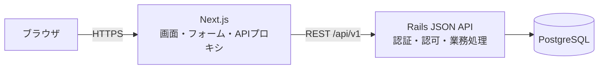
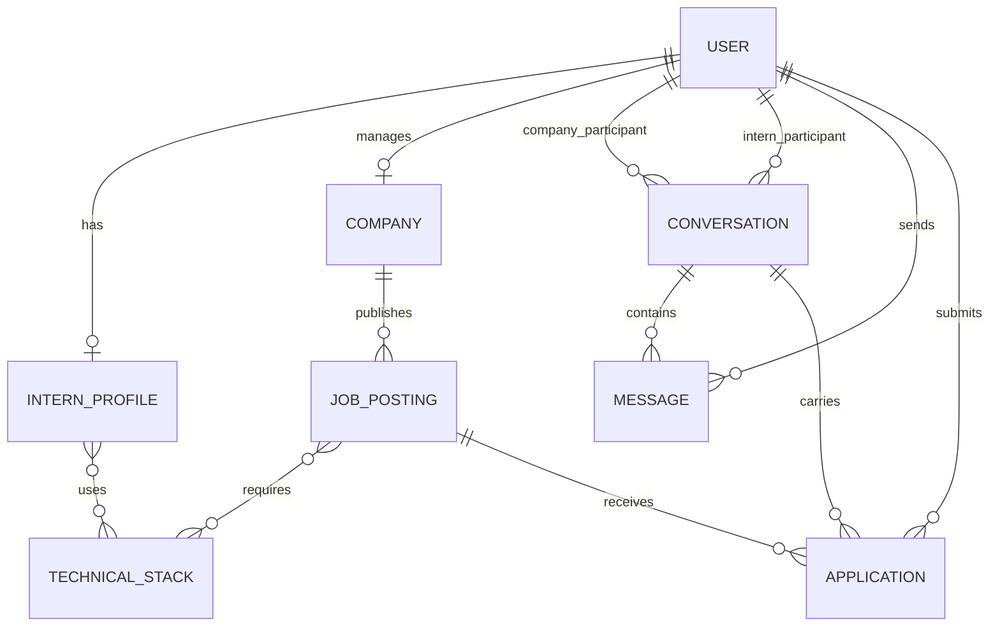
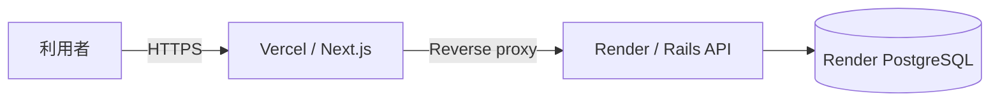

# アーキテクチャ設計

## 1. 設計目標

5日間で主要導線を実装し、ローカルと無料の公開環境で再現可能な構成にする。
短期間のプロトタイプに不要な分散システムを避け、認証・認可とデータ整合性は
省略しない。

## 2. システム構成

ブラウザはNext.jsとだけ通信する。Next.jsは `/api` 宛てのリクエストをRailsへ
中継し、ブラウザから見たオリジンを統一する。RailsだけがDBへ接続する。

## 3. 技術選定と理由

| 技術・方式 | 採用理由 |
|---|---|
| Next.js / TypeScript | 指定技術であり、画面、ルーティング、サーバー描画を統一できる。型によりAPI境界の誤りを減らせる。 |
| Rails JSON API | 指定技術であり、関連データ、入力検証、認可、DB transactionを短期間で実装しやすい。 |
| PostgreSQL | 関連の多いデータに外部キー・一意制約を適用でき、MVPの部分一致検索にも対応できる。 |
| REST API | 操作がCRUD中心であり、GraphQLより設計、実装、デバッグが単純になる。 |
| HttpOnly Cookie session | 認証情報をブラウザJavaScriptから読み取らせず、JWTの保存・失効機構を追加せずに済む。 |
| DBによる検索 | MVP規模ではPostgreSQLで十分であり、専用検索基盤の運用が不要になる。 |
| 通常のHTTP通信 | リアルタイム更新が要件外であり、WebSocketやRedisを追加する必要がない。 |
| 正規化した技術スタック | プロフィールと募集で表記を再利用し、検索と重複防止を行いやすい。 |

マイクロサービス、GraphQL、Redis、WebSocket、専用検索エンジンは、MVPで得られる
利点より実装・運用コストが大きいため採用しない。

## 4. フロントエンド方針

- App Routerを用いる。
- Server Componentを基本とし、フォーム状態やブラウザ操作が必要な箇所だけ
  Client Componentにする。
- APIアクセス、表示、フォーム状態を分離する。
- ロール別の画面非表示はUX目的とし、セキュリティ判断はRailsへ委ねる。
- 各画面でloading、empty、validation error、通信エラーを扱う。
- ログイン後はinternを公開募集一覧、companyをインターン生一覧へ移動する。

主な画面ルート案:

| ルート | 利用者 | 内容 |
|---|---|---|
| `/` | 全員 | トップ |
| `/signup`, `/login` | 全員 | 登録、ログイン |
| `/profile/edit` | intern | プロフィール編集 |
| `/interns`, `/interns/:id` | company | インターン生検索、詳細 |
| `/jobs`, `/jobs/:id` | intern | 公開募集一覧、詳細、応募 |
| `/company/jobs` | company | 自社募集一覧 |
| `/company/jobs/new`, `/company/jobs/:id/edit` | company | 募集作成、編集 |
| `/conversations`, `/conversations/:id` | 両者 | 会話一覧、詳細 |
| `/settings/account` | 両者 | アカウント削除 |

## 5. バックエンド方針

- APIは `/api/v1` でversioningする。
- ControllerはHTTP境界に集中させ、応募・退会など複数モデルにまたがる処理は
  service objectまたは同等の小さな業務処理単位へ分離する。
- Strong Parameters、model validation、外部キー、一意制約を組み合わせる。
- 一覧APIはpaginationし、関連データを先読みしてN+1を避ける。
- エラー応答は `code`、`message`、必要に応じて `field` を持つ共通形式にする。
- pagination応答には現在ページ、総ページ、総件数を含める。

主なAPI案:

| Method / Path | 主な権限 | 用途 |
|---|---|---|
| `POST /api/v1/auth/registrations` | 未認証 | intern / company登録 |
| `POST /api/v1/auth/session` | 未認証 | ログイン |
| `DELETE /api/v1/auth/session` | 認証済み | ログアウト |
| `GET /api/v1/me` | 認証済み | 現在の利用者 |
| `PATCH /api/v1/me/intern_profile` | intern | プロフィール保存 |
| `DELETE /api/v1/me/account` | 認証済み | 退会・匿名化 |
| `GET /api/v1/interns` | company | 一覧・検索 |
| `GET /api/v1/interns/:id` | company | 詳細 |
| `GET /api/v1/conversations` | 認証済み | 自分の会話一覧 |
| `GET /api/v1/conversations/:id` | 参加者 | 履歴 |
| `POST /api/v1/conversations` | company | 会話開始と初回スカウト |
| `POST /api/v1/conversations/:id/messages` | 参加者 | 返信 |
| `GET /api/v1/job_postings` | intern | 公開募集一覧 |
| `GET /api/v1/job_postings/:id` | intern | 公開募集詳細 |
| `POST /api/v1/job_postings/:id/applications` | intern | 応募 |
| `/api/v1/company/job_postings/*` | company / owner | 自社募集CRUD |
| `GET /api/v1/health` | 全員 | 稼働確認 |

## 6. 認証・セキュリティ

実装詳細は [アカウント登録・認証 詳細設計](detailed-design-auth.md) を参照する。
プロフィールの実装詳細は
[インターン生プロフィール 詳細設計](detailed-design-intern-profile.md) を参照する。
企業向け検索の実装詳細は
[インターン生一覧・詳細・検索 詳細設計](detailed-design-intern-search.md) を参照する。
会話機能の実装詳細は
[スカウト・会話・メッセージ 詳細設計](detailed-design-conversations.md) を参照する。
募集と応募の実装詳細は [募集・応募 詳細設計](detailed-design-job-postings.md) を参照する。
退会処理の実装詳細は
[アカウント削除・匿名化 詳細設計](detailed-design-account-deletion.md) を参照する。

1. ログイン成功時にRailsがsessionを作成する。
2. CookieへHttpOnly、Secure、適切なSameSite属性を設定する。
3. 状態変更リクエストはCSRF対策を行う。
4. Railsはリクエストごとにログイン状態と `deleted_at` を確認する。
5. roleだけでなく、募集所有者、会話参加者、応募者を必ず検証する。

Next.jsのrewriteでブラウザからの接続先を同一オリジンに統一する。Rails APIの
直接URLを指定されても、正しいsessionと権限がなければ情報を返さない。

## 7. データモデル

主要制約:

- `users.email`: 大文字小文字を正規化した一意制約
- `conversations(company_user_id, intern_user_id)`: 一意制約
- `applications(job_posting_id, intern_user_id)`: 一意制約
- profile / job postingと同一technical stackの組み合わせ: 一意制約
- roleに合わない関連付けをapplication validationとDB制約で可能な範囲まで拒否
- 検索列、外部キー、会話更新日時へindexを設定

ConversationはプロフィールではなくUserを参加者として持つ。プロフィール削除後も
相手側に匿名化された履歴を残すためである。

## 8. 重要な業務処理

### 応募

一つのDB transactionで次を実行する。

1. 募集が公開中で、応募者がinternであることを確認する。
2. 重複していないApplicationを作成する。
3. 掲載企業とのConversationを作成または再利用する。
4. 募集タイトルを含むapplication種別のMessageを作成する。

一意制約により、連打や同時リクエストでも重複応募を防ぐ。

### アカウント削除

User行は履歴の参照整合性を維持するために残し、退会状態へ変更する。

- sessionを無効化する。
- emailと認証情報を復元不能な値へ置換する。
- InternProfileを削除し、企業の場合はCompanyを匿名化して募集を非公開にする。
- Userへ `deleted_at` を記録する。
- 既存Messageは残し、表示時に「退会済みユーザー」とする。
- 退会Userを含む会話では新規送信を拒否する。

## 9. テスト戦略

### Rails

- model test: validation、一意制約に対応する振る舞い、掲載条件
- request test: 登録、session、検索、募集、応募、会話、退会
- authorization test: role、所有者、参加者、非公開リソース
- transaction test: 応募途中の失敗時にApplicationとMessageが残らないこと

### Next.js

- component test: フォーム、文字数、エラー、空状態、確認画面
- API境界をstubし、利用者から見た操作を検証する。
- lint、型チェック、production buildを必須にする。

### 結合確認

- intern登録 → プロフィール掲載
- company登録 → 検索 → スカウト
- intern返信
- company募集公開 → intern応募 → 自動メッセージ
- 権限外アクセス拒否 → 退会・匿名化

## 10. ローカル・CI・公開環境

### ローカル

- Next.js: `localhost:3000`
- Rails: `localhost:3001`
- PostgreSQL: Docker
- 架空のseedデータで主要導線を再現する。
- 環境変数の名前と用途を `.env.example` に記載する。

### CI

GitHub ActionsでRails test、Railsの読み込みチェック、Next.js lint、test、buildを
実行する。必須検証が失敗した変更は公開しない。

### 公開環境

- VercelとRenderの無料構成を利用する。
- GitHubのmain branchから自動デプロイする。
- migrationをRailsのデプロイ前処理として実行する。
- secretはホスティングサービスの環境変数で管理する。
- Vercelの公開URLをデモURLとする。
- Render APIにhealth checkを設定する。

無料Render Web Serviceは15分間アクセスがないと停止し、再起動に時間がかかる。
無料PostgreSQLは作成後30日で失効するため、デモ前に起動とデータを確認する。

参考:

- [Vercel: Next.js](https://vercel.com/docs/frameworks/full-stack/nextjs)
- [Vercel: Rewrites](https://vercel.com/docs/routing/rewrites)
- [Render: Rails](https://render.com/docs/deploy-rails-8)
- [Render: Free instances](https://render.com/docs/free)

## 11. 5日間の実装順序

| 日 | 主な成果 |
|---|---|
| 1日目 | リポジトリ初期化、DB、登録、session認証 |
| 2日目 | プロフィール、企業向け一覧・詳細・検索 |
| 3日目 | 会話、スカウト、返信、認可テスト |
| 4日目 | 募集、応募、自動メッセージ、退会 |
| 5日目 | UI状態、総合テスト、CI、公開、README |

各日の完了時点で関連テストを通し、最終日へ未検証機能をまとめて残さない。
